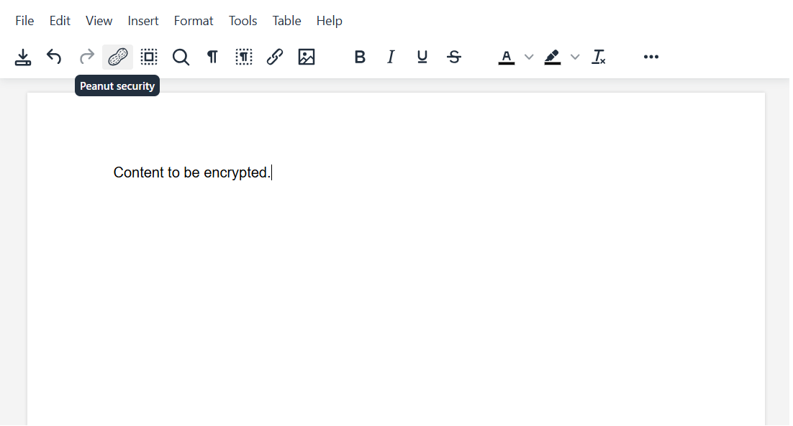

#  Peanut Security

## Description

**Peanut Security** is a TinyMCE 6+ plugin that encrypts editor content **locally** before it ever leaves your device.

Plain text **never** gets sent to the server. When Peanut Security is enabled, the server only receives an encrypted string.

When encryption is toggled on, the saved content looks like this on the server:

`<!--PEANUT_1.0_ENCRYPTED_TINYMCE-->0121b9fea7226cc5ce3e548ab878b10020218c89aee5fc9b366a016cf59f9472284a59efe7e845c7fa28d6c0ecb4a79c7597db1f3e5a252b3a45ac1f85f9123b+t4dMxIPWC7YsNPEZqpEKh0ut67UblxUS5Wn3sYCq8c=<!--/PEANUT_1.0_ENCRYPTED_TINYMCE-->`

Only **you**, on your local device, can decrypt the content.

Peanut Security uses **AES-256 encryption** with **80,000+ PBKDF2 iterations**, making brute-force attacks extremely time-consuming even with weak passwords.

---

## Installation

Copy the `peanut` folder from `peanut/dist/` into the TinyMCE `plugins` directory.

---

## Configuration

### 1. Enable the plugin

In your `tinymce.init()` configuration, add `peanut` to both `plugins` and `toolbar`.

### 2. Optional menu items

You may also add the following menu items:

- `peanut`
- `peanut_change_pw`

### 3. Plugin options

| Option | Type | Default | Description |
|------|------|---------|-------------|
| `peanut_timeout_sec` | number | `480` | Auto-lock timeout in seconds due to inactivity. Set to `0` to disable inactivity locking. |
| `peanut_esc_lock` | boolean | `true` | Lock content when the **ESC** key is pressed. Set to `false` to disable this behavior. |

---

## Usage

1. Click the **Peanut** button to enable encryption and set your password (confirmation required).
    - The **hashed password** and **plain content** are stored **only in local device memory**.
2. Saving the document triggers encryption.
    - Only the encrypted string is sent to the server or leaves your device (depending on your setup).
3. By default, the editor automatically locks after **8 minutes of inactivity**.
    - This protects sensitive content if you step away and someone else accesses your screen.
4. When loading content from the server, Peanut Security automatically detects encrypted data and attempts to decrypt it if the format matches Peanut Security.

---
